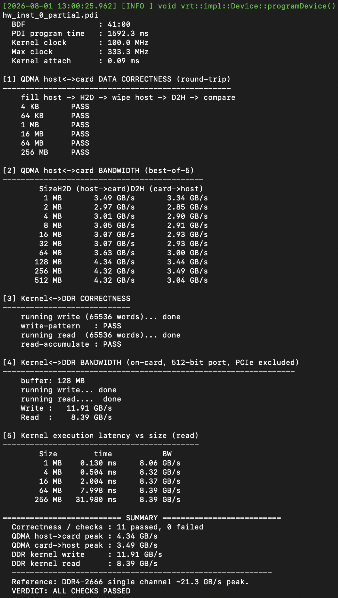

# FELIX SLASH — Build Runbook

Command runbook to (A) build the base DFX hardware from scratch and (B) link an HLS kernel
against that shell into a partial PDI / `.vbin`. Target: FELIX FLX-155
(`xcvp1552-vsva3340-2MHP-e-S`), Vivado/Vitis **2025.1**.

All paths are relative to `porting_slash/slash_felix/`.
For the full explanation of the flow, files, and bugs see `linker/FELIX_LINKER_GUIDE.md`.

---

## 0. Environment (every shell)

```bash
source /tools/Xilinx/2025.1/Vitis/settings64.sh
cd ~/VersalPrjs/felix/felix-xpfm-pcie/porting_slash/slash_felix
```

---

## Phase A — Build the base hardware from scratch (one-time, ~1 h)

> **PREREQUISITE — build the HLS iprepo IP first.** `hbm_bandwidth` (and the
> linker's `traffic_producer`) are HLS kernels whose packaged IP lives in a
> gitignored `ip/` dir, so a fresh clone does **not** have them. Without this
> you get: `ERROR [BD 5-390] IP definition not found for VLNV:
> xilinx.com:hls:hbm_bandwidth:1.0`. Build them once:
>
> ```bash
> # for the DFX hardware build (dfx_build uses hbm_bandwidth):
> ( cd iprepo/hbm_bandwidth && make )
> # for the linker (base/iprepo self-test kernels):
> ( cd linker/resources/base/iprepo/hbm_bandwidth && make )
> ( cd linker/resources/base/iprepo/traffic_producer && make )
> ```

```bash
# A1. Build the DFX project: felix_cips static region + slash & service_layer
#     RMs + wrapper + pblocks + DFX configuration. Creates dfx_build/proj/.
#     (Skip this if dfx_build/proj/ already exists and you want to keep it.)
vivado -mode batch -source dfx_build/scripts/run_all.tcl

# A2. Synthesis + implementation + write_device_image, plus export of the
#     abstract shells, XSA, and routed black-box DCP.
vivado -mode batch -source dfx_build/scripts/run_impl.tcl

# A3. Publish the slash abstract shell into the linker resources.
cp dfx_build/proj/felix_slash.runs/impl_1/abs_shell_slash.dcp \
   linker/resources/abstract_shell/abs_shell_slash.dcp

# A4. Generate the slash_base partition-boundary BD (into resources/).
( cd linker && vivado -mode batch -source gen_slash_base.tcl )
```

After Phase A, `linker/resources/` is complete:
`abstract_shell/abs_shell_slash.dcp`, 
`abstract_shell/slash_base/slash_base.bd`,
`base/iprepo/`, 
`bd_ports.txt`, 
`slash.tcl`, 
`system_map.xml`,
`base/scripts/slash_project_build.tcl`.

---

## Phase B — Link an HLS kernel against the shell (per kernel, ~12 min)

Example: `00_axilite` (`increment` + `accumulate`, `increment`→DDR0).

```bash
# B1. Synthesize the HLS kernels to IP (component.xml).
#     Each kernel's hls/<k>.cfg must have: part=xcvp1552-vsva3340-2MHP-e-S
cd examples
./build_hls.sh 00_axilite increment accumulate
cd ..

# B2. Link the kernels into the slash partition -> partial PDI + .vbin.
ROOT=$(pwd)
HLS=$ROOT/examples/00_axilite/hls
V80PP_RESOURCE_DIR=$ROOT/linker/resources \
python3 linker/src/main.py link \
  -c $ROOT/examples/00_axilite/config.cfg \
  -p hw \
  -o $ROOT/examples/00_axilite/axilite_hw.vbin \
  -k $HLS/build_increment.xcvp1552-vsva3340-2MHP-e-S/hls/impl/ip/component.xml \
     $HLS/build_accumulate.xcvp1552-vsva3340-2MHP-e-S/hls/impl/ip/component.xml \
  --vivado "$(which vivado)"

# B3. Inspect the result.
tar tzf examples/00_axilite/axilite_hw.vbin
```

Second example — `01_aximm` (`dma`→DDR1, `offset`→DDR0):

```bash
cd examples && ./build_hls.sh 01_aximm dma offset && cd ..
ROOT=$(pwd); HLS=$ROOT/examples/01_aximm/hls
V80PP_RESOURCE_DIR=$ROOT/linker/resources \
python3 linker/src/main.py link \
  -c $ROOT/examples/01_aximm/config.cfg -p hw \
  -o $ROOT/examples/01_aximm/aximm_hw.vbin \
  -k $HLS/build_dma.xcvp1552-vsva3340-2MHP-e-S/hls/impl/ip/component.xml \
     $HLS/build_offset.xcvp1552-vsva3340-2MHP-e-S/hls/impl/ip/component.xml \
  --vivado "$(which vivado)"
```


Example `04_test_felix`  should run a full test (ddr, qdma bandwidth, data check) and print something like :
```bash
./examples/04_test_felix/build/04_test_felix 0000:41:00 ./examples/04_test_felix/test_felix_hw.vbin
```



---

## Adding your own kernel

1. Put `<k>.cpp` + `<k>.cfg` under `examples/<dir>/hls/`.
   The `.cfg` must set `part=xcvp1552-vsva3340-2MHP-e-S` and `syn.top`/`syn.file`.
2. Edit `examples/<dir>/config.cfg` `[connectivity]`:
   - `nk=<kernel>:<count>:<inst>` — instantiate
   - `stream_connect=A_0.axis_out:B_0.axis_in` — optional kernel↔kernel AXIS
   - `sp=<inst>.m_axi_gmem0:DDR0` — map AXI-MM to memory.
     **Valid felix targets: `DDR0-3`, `VIRT0-3`, `HOST`** (no HBM/MEM).
3. Run B1 (`build_hls.sh`) then B2 (`link`).

---

## Success looks like

```
write_device_image -cell felix_cips_i/slash completed successfully
vbin archive complete: .../<name>.vbin
```

The `.vbin` (gzip tar) contains:
`images/top_i_slash_slash_<proj>_inst_0_partial.pdi`,
`report_utilization_<proj>.xml`, `system_map.xml`.

---

## Verification status (what was actually run, 2026-07-20, Vivado/Vitis 2025.1)

| Step | Status |
|---|---|
| A1 `run_all.tcl` | **NOT re-run this session** — `dfx_build/proj/` already existed; impl was run against it. Earlier proven flow (git: "impl ran after adding pblocks", "bit file generated"). |
| A2 `run_impl.tcl` | ✅ ran from scratch (synth+impl+device image+abstract shell+XSA+routed_bb, ~55 min) |
| A3 copy abstract shell | ✅ |
| A4 `gen_slash_base.tcl` | ✅ built + validated `slash_base.bd` |
| B1 HLS (`v++`/`vitis-run`) | ✅ real Vitis HLS for increment/accumulate/dma/offset on vp1552 |
| B2 link (both examples) | ✅ `LINK_EXIT=0`; `axilite_hw.vbin` (949 KB), `aximm_hw.vbin` (952 KB) |

---

## Common errors → fixes

| Error | Fix |
|---|---|
| `[BD 5-390] IP definition not found for VLNV: xilinx.com:hls:hbm_bandwidth:1.0` | HLS iprepo IP not built — run `make` in `iprepo/hbm_bandwidth` (see Phase A prerequisite) |
| `sp=...:HBM*` / `:MEM` not found | felix has no HBM/MEM — use `DDR0-3` / `VIRT0-3` / `HOST` |
| `connect_bd_net requires at least two pins` on `user_clk` | a renamed boundary pin still hardcoded in `linker/src/emit/`; grep + fix |
| `KeyError` in `generate_util_report` | hardcoded top/cell name; partial PDI already written, only metadata failed |
| boundary / partition-pin mismatch at `write_device_image` | regenerate `slash_base.bd` + `abs_shell_slash.dcp` from the *same* design |
| `[Mig 66-441]` DDR pin triplet (hw build) | DDR rank/config — `MC_RANK 2` at creation (dfx_build 00 script) |
